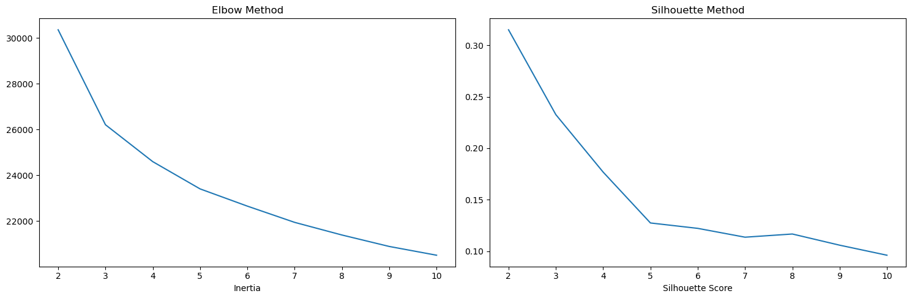

[](https://www.linkedin.com/in/alex-teixeira-soares-dos-santos-203137a8/)
[](https://www.python.org/)


## Case iFood

Considere uma empresa bem estabelecida que atua no setor de varejo de alimentos. Atualmente, eles têm milhares de clientes registrados e atendem quase um milhão de consumidores por ano. Eles vendem produtos de 5 grandes categorias: vinhos, carnes, frutas exóticas, peixes especialmente preparados e produtos doces. Estes podem ser divididos ainda mais em produtos *gold* e regulares. Os clientes podem encomendar e adquirir produtos por meio de 3 canais de vendas: lojas físicas, catálogos e site da empresa. Globalmente, a empresa teve receitas sólidas e uma linha de fundo saudável nos últimos 3 anos, mas as perspectivas de crescimento dos lucros para os próximos 3 anos não são promissoras... Por esse motivo, várias iniciativas estratégicas estão sendo consideradas para inverter essa situação. Um deles é melhorar o desempenho das atividades de marketing, com foco especial em campanhas de marketing.


Projeto baseado em um processo setivo para Analista de dados do iFood disponível [neste repositório](https://github.com/ifood/ifood-data-business-analyst-test).


## Objetivo

Construir um modelo preditivo que apoiará iniciativas de marketing direto que produza maior lucro para a próxima campanha.

Objetivos detalhados:

- Realizar uma análise exploratória robusta.
- Segmentação de clientes através da base fornecida.
- Determinar o melhor número de clusters.
- Construir um modelo de classificação para prever se um cliente irá comprar o produto oferecido na campanha.
- Fornecer insights de negócio agregar valor a empresa partindo de dados.

## Estrutura do repositório

```
├── case
├── data
├── images
├── notebooks
├── reports
```

- Na pasta `case` temos o objetivo do projeto.
- Na pasta `data` estão os dados utilizados no projeto. O arquivo ml_project1_data.csv é o dataset utilizado originalmente. Os demais arquivos são os datasets gerados durante o projeto.
- Na pasta `images` estão as imagens utilizadas neste README.
- Na pasta `notebooks` estão os notebooks com o desenvolvimento do projeto.
- Na pasta `reports` estão os relatórios gerados durante o projeto utilizando a biblioteca ydata-profiling.

## Detalhes da análsise

Uma descrição detalhada do dataset utilizado está disponível [aqui](data/README.md).

### Etapa 1: Análise exploratória

Com objetivo de resumir suas características para que possamos chegar a insights que irão nos orientar em anásises mais profundas. É de grande importância realizar esse procedimento pois através dele podemos formular hipóteses.

- Ao avaliar a base foi notado que temos a necessidade de criar algumas colunas como por exemplo: existe duas colunas uma com quantidade de crianças e outra com quantidade de adolescentes foi transformado para uma coluna HasChildren (tem filhos), outra coluna com intervalo de idades também foi criada entre outras.
- Identificamos outliers nas colunas **Age, Income e MntTotal** que aparentemente parece erro de digitação de usuário então dropamos essas linhas pois eram poucas.
- A escolha de colunas que adotamos como importantes para nossa análise é subjetivo sendo assim foi escolhido as colunas abaixo:
  - **Income(Renda)**: Essa coluna escolhida pois legal ver o comportamento de quem tem uma renda maior ou menos;
  - **Recency(Tempo para retorno)**: Para saber se o cliente tem compras recentes ou não;
  - **DaysSinceEnrolled(Dias cadastrado)**: Avaliar o comportamento dos clientes mais recentes versus os mais antigos;
  - **Age(idade)**: Assim como na coluna anterior ver o comportamento de consumo dos grupos de idade;
  - **MntTotal(Valor gasto total em produtos)**: Essa coluna por exemplo acho interessante correlacionar ela com a Income;
  - **HasChildren(tem filhos)**: E essa coluna foi escolhida para ser usada como um parametro hue no pairplot.
- Após análise dessas colunas utilizando boxplots foi percebido que poderiamos estar usando o Dummies e fazer uma correlação com nosso target.
- Foi gerado um no dataset "customers_new_features_and_drop"
- Segue abaixo visualização da nossa correlação:


##
### Etapa 2: Clusterização

Clustering é a categorização e agrupamento de dados de um conjunto. É feito através de características em comum entre dados.
O pré-processamento é fundamental na análise dos dados. pois ele envolve a limpeza de dados facilitando serem utilizados no aprendizado de máquinas.
Para essa etapa usaremos o arquivo gerado na última etapa(customers_new_features_and_drop).

- Após chamar o dataset gerado faremos um pré-processamento utilizando as funções: **OneHotEnconder** para converter as colunas categóricas em uma representação numérica, **StandardScaler** para padronizar as features removendo a média e escalonando para ter variância unitária, **MinMaxScaler** para realiza uma transformação linear em nossos dados, escalonando cada feature para um intervalo específico, geralmente [0, 1] e **PowerTransformer** está funcão irá aplicar transformações de potência para estabilizar a variância e tornar a distribuição dos dados mais próxima da normal.
- Com os resultados obtidos criamos um DataFrame, para aplicarmos dois métodos **Elbow Method** e uma técnica usada em análise de clusterização para que possamos determinar o número ideal de clusters a ser utilizado. E o **Silhouette Method** ulilizado para avaliar a validade dos clusters, ele mede quão semelhantes são os objetos no mesmo cluster e a diferença dos clusters vizinhos.

  

Com um pipeline com pré-processamento, PCA e K-Means, a base foi segmentada em 3 clusters:


Analise por Cluster:
- Cluster 0: 
  - Renda alta 
  - gasto alto 
  - muito provalmente não tem filhos
  - mais propenso a aceitar campanhas
  - cluster sem pessoas com escolaridade básica
  - sem um perfil de idade que se destaque
  

- Cluster 1: 
  - Renda baixa 
  - gasto baixo 
  - provalmente tem filhos
  - baixa propensão a aceitar campanhas
  - único cluster com porcentagem significativa de pessoas com escolaridade básica
  - pessoas mais jovens
  

- Cluster 2: 
  - Renda intermediária
  - gasto intermediário
  - provalmente tem filhos
  - pode aceitar campanhas
  - pessoas com idade mais elevada
##

### Etapa 3: Escolha de um modelo preditivo para classificação

Três modelos de classificação foram treinados para prever se um cliente irá comprar o produto ofericido na campanha.
- **DecisionTreeClassifier**:
    - Definição: Um modelo que utiliza uma estrutura parecida com de uma árvore para tomar decisões, em cada nó do modelo existe uma pergunta que direciona para outro nó até chegar a uma decisão.
    - Aplicação: Pode ser usado para regressão e classificação, mas temos que ter certa atenção pois pode ser propenso a overffiting.
- **LogisticRegression**:
    - Definição: Modelo estatístico que utiliza funçao logística para modelar a probabilidade de uma variável. é um algoritimo de classificação binária.
    - Aplicação: Utlilzado principalmente para problemas de classificação binária exemplo: se uma pessoa tem divida no banco sim ou não. Poder ser estendido a problemas de classificação multiclasse.
- **KNeighborsClassifier**:
    - Definição: Algoritmo de aprendizado supervisionado que classifica um ponto de dados com base nas classes de seus k vizinhos mais próximos.
    - Aplicação: Útil em problema de classifação e regressão é sensível á escala de variáveis.
- **DummyClassifier**: Geralmete usado para avaliar desempenho de modelos. Seu papel é oferecer uma referência simples para comparação dos modelos.

Plotamos os resultados obtidos para melhor entendimento:


Com base nessa comparação, o modelo **LogisticRegression** foi escolhido para passar por uma otimização de hiperparâmetros.
##

 ### Como reproduzir o projeto

O projeto foi desenvolvido utilizando o Python 3.11.5. Para reproduzir o projeto, crie um ambiente virtual com o Conda, ou ferramenta similar, com o Python 3.11.5 e instale as bibliotecas abaixo:

| Biblioteca       | Versão |
| ---------------- | ------ |
| Imbalanced-Learn | 0.11.0 |
| Matplotlib       | 3.7.1  |
| NumPy            | 1.21.5 |
| Pandas           | 1.4.4  |
| Scikit-Learn     | 1.3.2  |
| Seaborn          | 0.12.2 |

Essas são as bibliotecas principais utilizadas no projeto.


